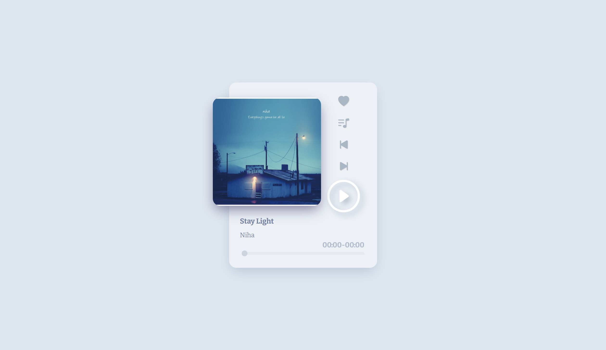
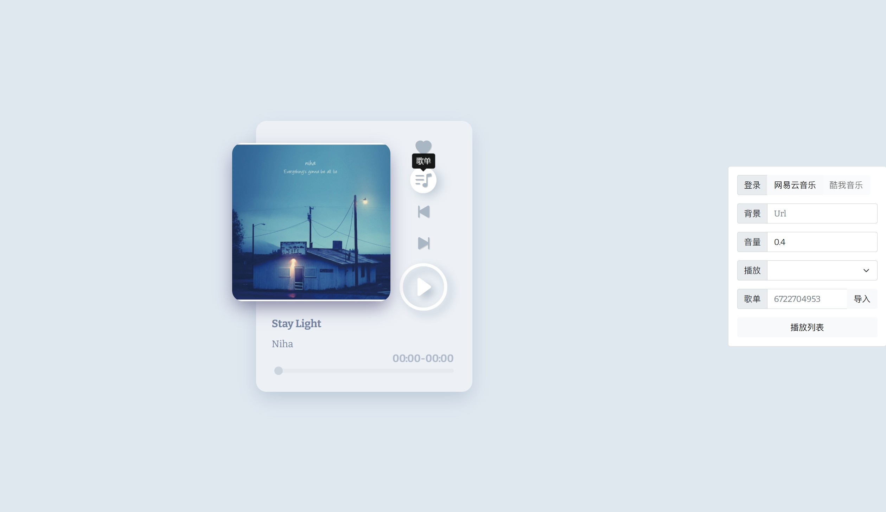

# Ease Music

本项目是个人初见 Vue 的小练习（低仿的网易云播放器

（只会前端三件套的弱狗第一次学这种东西）

## 技术栈

PC 端为主，没有适配移动端；也没有考虑浏览器兼容

> api：[网易云音乐 NodeJS 版 API](https://binaryify.github.io/NeteaseCloudMusicApi/)
>
> Bootstrap
>
> Axios
>
> Vue.js
>
> Less
>
> - vue3-draggable-resizable
>
> - nprogress
>
> - vuex

[演示地址](https://ease-music.vercel.app/)

## 界面：

主要是想做简洁一些，所以只放了自己最常用的功能（以最新版为准）

## 功能

🌕 播放器基本功能：

上一曲、下一曲、播放、暂停、单曲循环、列表循环、随机循环、进度条、音量控制

🌕 歌单相关功能：

搜索、导入歌单、网易云登录、导入个人歌单列表、歌单点播、收藏歌曲、播放收藏歌曲

🌕 没有实际作用的功能：

背景更换（链接/本地上传）、界面可拖拽

## 后续

- [x] 解决目前大部分 bug 🐛
- [x] 背景支持本地上传 🖻
- [x] 优化音量控制条样式 📢
- [x] 歌曲搜索功能 🔎
- [x] 主组件支持拖拽（没啥用，但感觉很叼）🐮
- [x] 播放收藏歌曲 右键红心 💖
- [x] 收藏歌曲本地保存 🏠
- [x] 提示说明键 ❓
- [x] 背景模糊效果 
- [x] 资源无法播放是自动跳转
- [x] 错误信息浮窗 🗔
- [x] tooltip
- [x] less样式
- [ ] 移动端适配（有生之年了）

## 版权说明

该项目签署了MIT 授权许可，详情请参阅[LICENSE.md](./LICENSE)

## 鸣谢

灵感来源于[Vue全家桶打造自适应 web 音乐播放器](https://juejin.cn/post/6844903608622956557)

感谢[网易云音乐 NodeJS 版 API](https://binaryify.github.io/NeteaseCloudMusicApi/)

感谢好兄弟的骚操作让我看到巨大的优化空间
